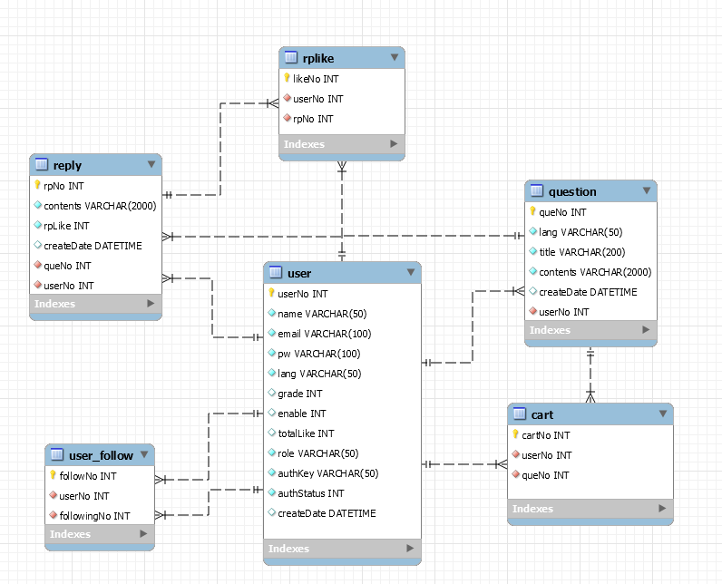

# README

## 0713

### 1. 공지사항

1. Sub1 목적

   - Sub2부터 팀 PJT를 잘 하기 위한 준비 기간
   -  Vue, React, DB, linux 등 아직 생소한 기술에 익숙해지기
   - 팀 빌딩과 Sub2부터 팀 PJT 무엇을 할지 회의
   - 평가 - 수업 태도, 팀워크, 산출물 등 종합적인 평가
   - 산출물 종류 - Req 구현(몇 개만 해도 무방), 기획서, 화면 설계서, ERD, Read me, Git, Jira

   

2. 1일 1commit/push

   

3. jira 이슈 등록

### 2. 오늘 한 일

1. 주제 정하기

	개발자 커뮤니티 - 코드 리뷰, QnA 등 

2. 역할 분담

   |       front-end        |    back-end    |
   | :--------------------: | :------------: |
   | 김민지, 도정우, 안시경 | 김홍준, 백단비 |

3. 프로젝트에 필요한 환경 설정 세팅

   node.js 설치, yqrn 설치, vue 프로젝트 생성, spring boot 설치, Docker설치 + MariDB설치

4. 스켈레톤 코드 실행 

   

   

### 3. 앞으로 공부해야할 것

|               front-end                |    back-end    |                 공통                 |
| :------------------------------------: | :------------: | :----------------------------------: |
| 스토리보드, vue, html, css, javascript | spring, docker | jenkins, 모델링, 배포, 세부적인 기능 |

## 0714

- git branch 공부 (https://lab.ssafy.com/jeongseok95/til/tree/master/0714)

## 0715

### 1.  Ground Rules

> 집중 코딩 시간 : 10:00~ 12:00 , 14:00 ~ 17:30 

1. 쉬는 시간 : 자유
2. 서로 스스럼없이 물어보기
3. 스크럼 미팅 후 박수 3번으로 끝내기
4. 결과가 나쁘더라도 격려해주기
5. 포기하지 말기

### 2. 오늘 한 일

1. 상세 기능 계획
    - accout
       - 팔로우/팔로잉
       - 내질문/ 답변보기(페이징)
       - 찜한 글
    - community
       - QnA : 좋아요, 글 저장(찜) => main
       - 랭킹보기 (답글 좋아요 순)
       
       
    
2. 스토리 보드 만들기

    - main page
    - index page
    - detail page

 

### 3. 다음에 할 일

- javascript 공부
- vue.js 공부

## 0716

### 1. 오늘 한 일

< DB >

- user
  uid, name, email, pw, grade, follow, follower , lang, private(int)
  -다 string

- follwo_user
  follow_id , follower_id

- qna
  qna_num(int), contents, qna_like(int), rp_cnt(int), create_date(date) , (uid-fk) 

- qna_rp
  rp_num(int), contents, rp_like(int), create_date(date), (qna_num, uid-fk) 

< 페이지 상세 기능 >
1. main

   - 언어별 검색기능

2. account

    - 팔로우/팔로잉
    - 내질문/ 답변보기(페이징)
    - 찜한 글

3. community

    - 검색창에서 검색 후 페이지 : 키워드 관련 질문을 최신순으로 조회
    - 메뉴에서 해당 언어 선택시 관련된 모든 질문 최신순으로 조회
    => 좋아요순, 답글순으로 페이지 정렬추가, askquestion 기능+ (선택 : 해시태그 - 기본기능완성 후 추가할 계획)
    -메인페이지 : create askquestion 
    - qna 상세페이지 : 상세 내용 조회, bookmark(찜하기) 기능 , 질문과 답글 좋아요 기능, 답글달기 기능 , (update, delete question) , (update ,delete ,create reply) 
    - 명예의 전당 페이지 : 등급 순으로 랭킹 정렬 + (선택 : 승급 시 필요한 likes수 기능 ) 
    - 회원프로필 페이지 :  팔로우and팔로잉 수 나타내기(클릭시 목록 조회), 회원정보 조회 , user가 쓴 질문&답글 최신순 조회, bookmark목록 조회
    - 로그인 페이지 : sns로그인, security인증 후 로그인, 비밀번호 변경
    - 회원가입 페이지 : id, 별명 중복 확인, email인증
    - askquestion 페이지 : create ask
    - 코드실행기(추가구현)

### 2. 다음에 할 일

- 추가 화면설계도
  - 회원 정보에서 팔로우,팔로잉 클릭시 팔로우,팔로잉 
  - 목록 페이지
  - 회원정보 수정페이지

## 0717

### 1. 오늘 한 일

- 스토리보드 제작

- ERD 설계

  

## 0720

### 1. 오늘 한 일

- Vue.js  개발 환경 구축
  - Vue api를 이용해 백 엔드와 연결하는 것, 배포는 아직 몰라도 될 것 같아서 Vue 개발을 시작하기로 함
  - Vue.js 개발 환경을 구축함
    - vscode 확장 프로그램 Vetur 설치함
    - Google Chrome에서 Vue.js devtools를 설치하려고 했는데 계속 크롬에 추가하지 못했다며 오류가 뜸 => 컴퓨터 껐다 켜니 해결됨
    - cdn, axios 코드 복사 붙여넣기 해놓음
- 옛날 실습 자료와 현재 프로젝트 명세를 보며 어떻게 코드를 짜면 좋을지 생각함

### 2. 다음에 할 일

- 피드백 받기
- vue template 적용하기
- vue main page 설계, 제작하기

## 0721

### 1. 오늘 한 일

- 피드백 받음
  - ~~계획 구체적으로 정하기~~
  - 스토리보드 보완하기 
  - ERD 수정하기
- git branch 실습

### 2. 다음에 할 일

- 스토리보드 보완하기
- ERD 수정하기
- vue template 적용하기

## 0722
### 1.  오늘 한 일

- Vue template 적용

- 스토리보드 수정 - detail, bookmark, my record, profile, the hall of fame

### 2. 다음에 할 일

- main page
- sign up page
- sign in page

## 0723

### 1. 오늘 한 일

- 스토리 보드 - main, ask question, index

### 2. 다음에 할 일

- main page
- sign up page
- sign in page

## 0724

### 1. 오늘 한 일

- vue template 안 쓰고 부트스트랩 쓰기로 해서 템플릿 적용된 거 지움
- main page, sign up page, sign in page 
  - main page
    - header
    - 로고 이미지 
    - 검색창
  - sign up page
  - sign in page

### 2. 다음에 할 일

- main page
  - 로고 이미지 반응형으로 만들기
  - 검색창 테두리 안 나오는 거 해결하기
- sign up page
  - 헤더
  - 버튼 primary 적용
- sign in page
  - 헤더
  - 버튼 primary 적용
- 다른 페이지 생성하기